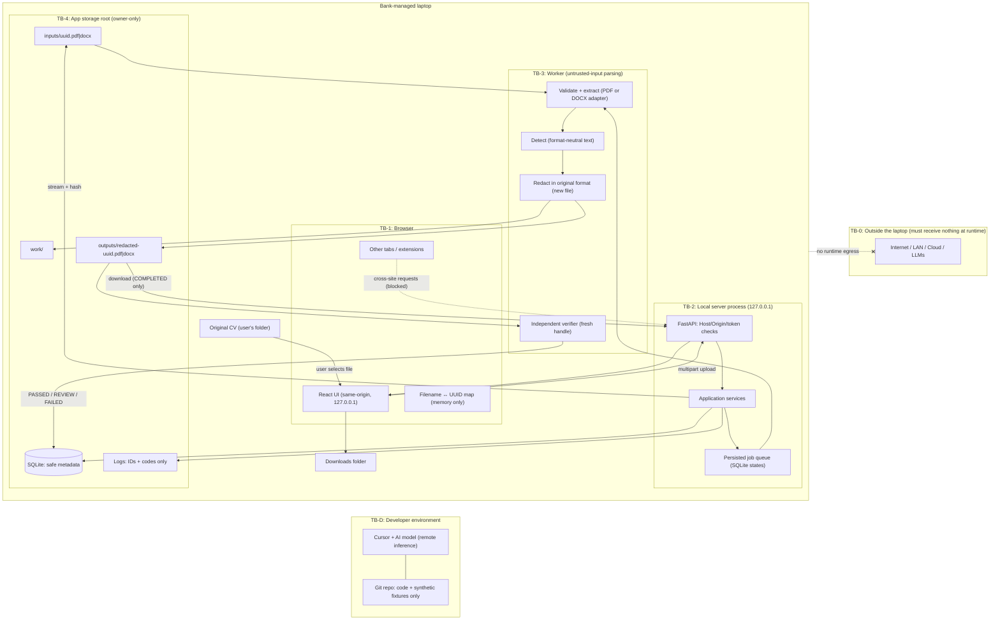

# Threat model

Status: localhost PoC (unsigned macOS launcher, loopback UI, synthetic
evaluation). PyMuPDF AGPL remains a residual until legal confirms. Related:
[SECURITY.md](SECURITY.md), [docs/data-retention.md](docs/data-retention.md),
[docs/masking-policy.md](docs/masking-policy.md), [docs/supported-pdf.md](docs/supported-pdf.md),
[docs/install.md](docs/install.md).

## 1. System summary

A single-user web app running on the HR user's bank-managed macOS laptop
(Windows is a future stage and will need this model revisited). The browser UI talks to a FastAPI server on `127.0.0.1`. One local worker
process (D-33) validates, detects, redacts, and independently verifies each CV (PDF or
DOCX; each is redacted and verified in its own format). Files
live in the project's `data/` folder (D-22); job metadata lives in SQLite at
`data/metadata/jobs.sqlite3` (D-25). No component
makes network calls beyond loopback.

## 2. Assets

| ID | Asset | Sensitivity |
|---|---|---|
| AS-1 | Uploaded CV (input copy) | High — full PII and sensitive attributes |
| AS-2 | Extracted text, spans, and detected values (in memory) | High |
| AS-3 | Masked output PDF | Medium — residual career data; High if redaction failed |
| AS-4 | Job metadata (IDs, states, counts, hashes, codes) | Low–Medium — hash can confirm a known file |
| AS-5 | Logs and CSV reports | Low if policy holds; High if PII leaks into them |
| AS-6 | Original filenames | High — often contain the candidate's name |
| AS-7 | Session/bootstrap token (Stage 14/15) | Medium — grants local API access |
| AS-8 | Source code, fixtures, dependency lockfiles | Integrity-critical |
| AS-9 | Evaluation report (JSON/Markdown) | Low if metadata-only; High if values or paths leak |

## 3. Actors

| Actor | Trust |
|---|---|
| HR user | Trusted to operate the app; may make mistakes (wrong file, wrong toggle). |
| Other local OS users / low-privilege processes | Untrusted. |
| Malware running as the HR user | Out of scope (cannot be defended by the app); see residual risks. |
| Malicious website open in the same browser | Untrusted; can send requests to `127.0.0.1`. |
| Malicious PDF author (candidate or forwarder) | Untrusted input. |
| LAN device | Untrusted; must not be able to connect. |
| Developer + Cursor/AI assistant | Trusted with code only; must never receive real CVs. |
| Dependency publisher (PyPI/npm) | Partially trusted; pinned and reviewed. |

## 4. Data-flow diagram and trust boundaries

| Boundary | Crossing | Control |
|---|---|---|
| TB-0 | Anything → network | No outbound code paths; no telemetry deps; tests block sockets (Stage 1+); no remote assets in build (Stage 15). |
| TB-1 → TB-2 | Browser → API | Loopback bind; Host allowlist; Origin check; startup token + CSRF (Stage 14); size limits. |
| TB-2 → TB-3 | API → parser of untrusted PDFs and DOCX | One separate worker process (multiprocessing `spawn`, same interpreter, anonymous pipe, no shell or socket); per-document time budget enforced by ending the process; replies are JSON rebuilt through domain constructors (never unpickled) with bounded sizes; page/size/decompression limits; parser exceptions mapped to safe codes (Stage 12). |
| TB-3 → TB-4 | Worker → disk | The worker only reads stored inputs and outputs; the API process stores outputs and writes all metadata. Random-UUID paths; containment; atomic writes; owner-only perms. |
| TB-2 → TB-1 | API → browser | Only COMPLETED outputs downloadable; status contains codes and counts only; `no-store` caching. |
| TB-D | Developer ↔ Cursor | Synthetic data only; `data/` in `.cursorignore` and `.gitignore` and refused by the file guard; agents never read `data/`; human rule in SECURITY.md. Runtime files share the workspace (D-22, accepted risk). |

## 5. Threats (STRIDE) and mitigations

| ID | STRIDE | Threat | Mitigation | Stage |
|---|---|---|---|---|
| T-01 | Info disclosure | Server bound to all interfaces; LAN device reads CVs. | Host fixed to `127.0.0.1` in code; startup refuses other hosts; test. | 1, 14 |
| T-02 | Spoofing | DNS rebinding: malicious site resolves its name to 127.0.0.1 and calls the API. | Strict Host allowlist (`127.0.0.1:<port>`); Origin check. | 14 |
| T-03 | Spoofing / Tampering | Cross-site request forgery from another tab (upload, delete, approve). | Startup token + CSRF token; SameSite; reject missing/foreign Origin. | 14 |
| T-04 | Info disclosure | PII in logs, exceptions, SQLite, API status, CSV, test snapshots. | Closed error enum; static messages; allowlisted log fields; no text columns for values; sentinel-string tests. | 2, 4, 14 |
| T-05 | Info disclosure | Original filename (contains name) persisted or logged. | UUID paths; filename never sent beyond upload handler; kept only in browser memory. | 3, 5, 13 |
| T-06 | Info disclosure | "Redaction" is only a visual overlay; text extractable underneath. | Redaction annotations + apply; verifier extracts text from output with a fresh parser. | 10, 11 |
| T-07 | Info disclosure | PII survives in metadata, XMP, links, bookmarks, attachments, forms, comments, hidden layers, invisible text, incremental revisions. | Always-strip list + hidden-content review; full rewrite save; verifier checks each category. | 6, 10, 11 |
| T-07a | Info disclosure | Candidate photo, or text inside an image (e.g. a pasted screenshot with contact details), passes through unmasked. | **Accepted residual risk (D-13).** Disclosed in UI, README, and reports. | 13, 16 |
| T-08 | Info disclosure | Detector misses an entity (false negative). | Over-redaction bias; review flags; verifier reruns mandatory detectors; measured recall; known-gap disclosure. | 7, 8, 11, 16 |
| T-09 | Tampering | Output marked COMPLETED without verification, or verifier trusts redactor state. | State machine allows COMPLETED only from verifier PASSED; verifier reopens file independently. | 2, 11 |
| T-10 | Tampering | Input overwritten or corrupted. | Inputs read-only after write; outputs are new files; hash check before/after. | 3, 10 |
| T-11 | Elevation / DoS | Malicious PDF exploits parser, decompression bomb, huge page count, infinite loop. | Worker isolation; limits; timeouts; pinned parser version; fuzz-style malformed fixtures. | 6, 12, 14 |
| T-12 | Tampering | Path traversal or symlink escape via IDs or archive entries. | Server-generated UUIDs only; containment check; symlink refusal; ZIP built from server paths. | 3, 13, 14 |
| T-13 | Info disclosure | Temp/work files left behind after crash. | Atomic writes; `finally` cleanup; startup + periodic sweeper (1 h for leftovers). | 3, 12 |
| T-14 | Info disclosure | ZIP includes inputs or work files. | ZIP built only from COMPLETED output paths; test asserts contents. | 13 |
| T-15 | Info disclosure | Frontend loads remote fonts/scripts or sends telemetry. | No remote URLs; CSP `default-src 'self'`; build scan for URLs. | 1, 13, 15 |
| T-16 | Tampering | Supply-chain compromise of a dependency. | Minimal deps; lockfiles with hashes; justification per dep; no install scripts where avoidable. | 1+ |
| T-17 | Info disclosure | Developer pastes real CV into Cursor, or agent reads runtime data. | SECURITY.md rules; synthetic-only fixtures; `.cursorignore`; runtime root outside repo. | 0 |
| T-18 | Repudiation | Unclear which policy/version produced an output. | Job records policy version, detector versions, software version. | 2, 4 |
| T-19 | DoS | Batch of large files, or one file that makes a parser or detector hang, freezes the laptop or the app. | One worker process, one document at a time (D-33); the queue is the persisted states, so it holds at most the batch limits; per-document time budget (120 s) ends the process, which is replaced for the next document; CPU work never runs on the API event loop. | 12 |
| T-20 | Info disclosure | Browser caches masked or input PDFs. | `Cache-Control: no-store`; downloads served with attachment disposition. | 14 |
| T-21 | Info disclosure | HR mistakes masked output for anonymous and shares widely. | UI + README state "masked, not anonymized"; report lists residual-risk notice. | 13, 16 |
| T-22 | Info disclosure | Hidden-content alert itself leaks content (e.g. attachment name, comment text). | Alert payload limited to category, count, page numbers or part type. | 6, 6b, 13 |
| T-23 | DoS / Elevation | Hostile DOCX archive: zip bomb, path traversal in entry names, XML entity expansion, external entity (XXE) reading local files. | In-memory reads with entry/size/ratio limits; entry-name validation; no extraction to disk; parser with DTDs, entities, and network disabled. | 6b, 14 |
| T-24 | Info disclosure | PII survives in DOCX places a reader doesn't see: tracked-change deletions, comments, hidden text, text-box fallback copies, field codes, document properties, thumbnail, alt text, author lists. | Always-strip list + hidden content always removed (D-32, supported-pdf.md §6); every copy redacted; verifier byte-searches every decompressed part. | 6b, 10b, 11b |
| T-25 | Info disclosure | Masked DOCX contains external relationships (linked image, remote template) so Word fetches a URL when HR opens it, revealing that the CV was opened. | External relationships are hidden content, always removed (D-32); hyperlink targets always stripped; verifier checks none remain. | 6b, 10b, 11b |
| T-26 | Tampering | "Redaction" in DOCX done by formatting (black highlight, white text, hidden text) leaving text intact. | Text is removed from XML and replaced by the label; formatting-only redaction is impossible in the implementation. | 10b |

## 6. Residual risks (accepted for PoC, must be presented)

1. Masking is not anonymization; remaining career data can re-identify candidates.
2. Detector recall is below 100%. Unlabeled free-text mentions of sensitive attributes
   (e.g. health or family details inside a paragraph) may be missed.
3. Malware or an admin on the laptop can read all app data and memory.
4. Browser extensions can read localhost pages.
5. Deleted files may be recoverable without FDE; SSDs do not guarantee overwrite.
6. Bank backup/DLP/EDR agents may copy app files.
7. Candidate photos and text inside images are not masked (D-13).
8. Text rendered as vector outlines (no text layer for part of a page) may not be detected.
9. The DOCX verifier checks structure and content but cannot confirm how Microsoft Word
   will render the output, because Word is not available to the app and must not be automated.
10. Cursor/AI assistants are remote services; the only protection is never giving them real data.
11. Runtime CVs live in `<project>/data/`, inside the Cursor workspace (D-22). `.cursorignore`
    is best-effort; a broad agent search or terminal command could read them.
12. Time Machine backs up `data/` unless it is excluded by hand, so deleted CVs may survive
    on the backup disk (D-22).
13. Stored inputs and outputs are never deleted automatically (D-23); they stay on the
    laptop until HR deletes them.
14. The metadata database keeps each input's SHA-256 until its batch is purged. A hash can
    confirm that a known file was processed. `secure_delete` zeroes purged rows in the live
    file, but APFS snapshots or backups taken earlier may still hold them.
15. The macOS launcher is unsigned and not notarized (D-39). Gatekeeper will warn.
16. PyMuPDF is AGPL-3.0 or commercial. This PoC does not settle the licence path.
17. The first browser URL contains a one-time bootstrap token. Referrer is `no-referrer`;
    the page strips the query. Browser history may still keep that first URL until the
    token is consumed.
18. Detector recall on this synthetic PDF set is not 100% for Stage 8
    section heuristics (`family_details`, `reference_name` false negatives
    in `make eval`). Real CVs will differ; authorized measurement is
    optional and human-only (D-40).
