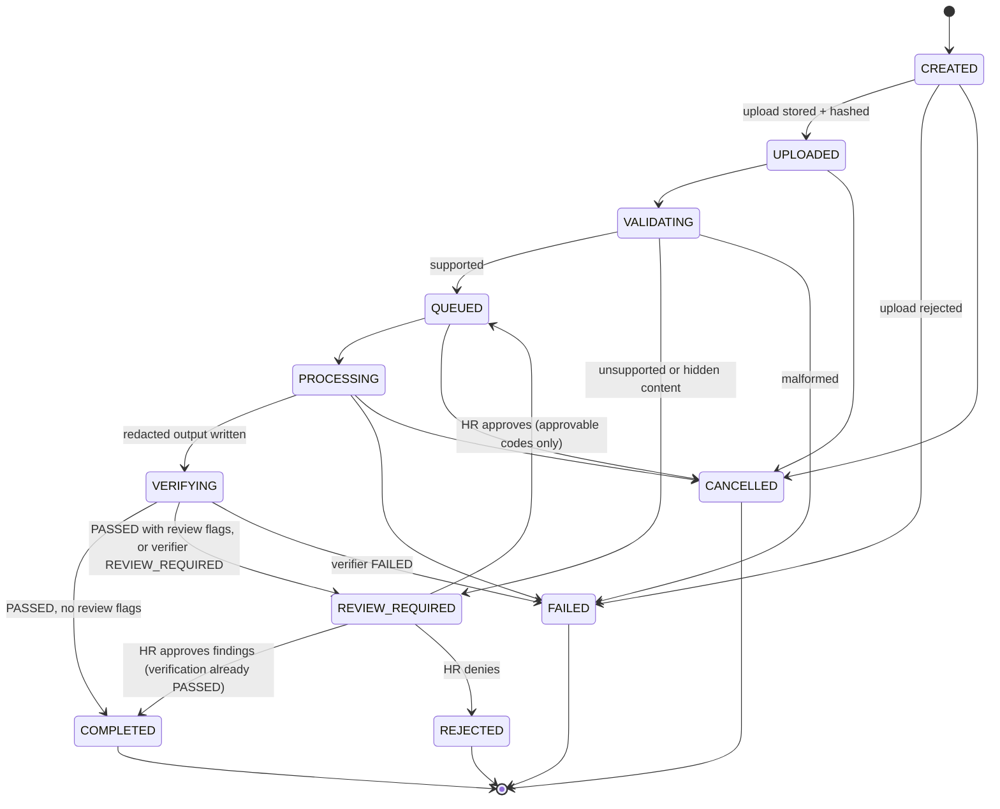

# Safe error-code taxonomy and document states

Status: Stage 0 baseline. Implemented as a closed enum in Stage 2; mapped to HTTP
responses in Stages 5 and 14.

## 1. Rules for every error

1. **Codes are a closed enum.** No free-form error strings cross a boundary (API, UI,
   SQLite, logs, CSV).
2. **Messages are static constants** keyed by code, localized (vi/en) in the UI. They are
   never built from exception text, file contents, file names, or paths.
3. **Allowed parameters** in any error payload: document UUID, batch UUID, page numbers,
   counts, configured limits, and the code itself. Nothing else.
4. **Exceptions are not persisted.** Stack traces go to stderr only in developer mode, with
   exception messages from third-party parsers suppressed (they may echo document bytes). In
   production mode only the code and a random correlation id are logged.
5. **Unknown errors fail closed** as `INTERNAL_ERROR` → document `FAILED`. No catch-all may
   convert an error into success or silently skip a document.
6. **One document's error never changes another document's state.**

## 2. Document states (proposed; finalized in Stage 2)

Terminal states: `COMPLETED`, `FAILED`, `REJECTED`, `CANCELLED`. Only `COMPLETED`
documents have a downloadable output. `COMPLETED` is reachable **only** through a
verification `PASSED` result.

Batch states: `OPEN` (accepting uploads) → `RUNNING` → `FINISHED` (all documents
terminal or `REVIEW_REQUIRED`) → `PURGED`.

## 3. Codes

`R` = retryable: HR may re-upload the same file into the batch; `T` = re-uploading the
same file will fail the same way. A `—` code is not an error but a review reason.
Error codes put the document in `FAILED` (terminal), except the non-approvable review
codes noted at the end of this section; per retention decision D-06 the
input is deleted at that point, so a retry is always a fresh upload.

### Upload (Stage 5)

| Code | R/T | Meaning |
|---|---|---|
| `UPLOAD_UNSUPPORTED_TYPE` | T | Not a PDF or DOCX (legacy `.doc`, image, other). |
| `UPLOAD_SPOOFED_TYPE` | T | Extension or content type disagrees with the file's content. |
| `DOCX_MACRO_OR_TEMPLATE` | T | Macro-enabled document or template (`.docm`, `.dotx`, `.dotm`). |
| `UPLOAD_FILE_TOO_LARGE` | T | Exceeds per-file size limit. |
| `UPLOAD_BATCH_FILE_LIMIT` | T | Batch already has the maximum number of files. |
| `UPLOAD_BATCH_SIZE_LIMIT` | T | Batch total size limit reached. |
| `UPLOAD_DUPLICATE` | T | Same content hash already in this batch. |
| `UPLOAD_MALFORMED_REQUEST` | R | Multipart request invalid or incomplete. |
| `UPLOAD_TIMEOUT` | R | Upload did not finish within the request timeout. |
| `UPLOAD_BATCH_CLOSED` | T | Batch is no longer accepting uploads. |

### PDF validation and extraction (Stage 6)

`PDF_HIDDEN_CONTENT` and `DOCX_HIDDEN_CONTENT` are the only approvable
validation reasons.

| Code | R/T | Meaning |
|---|---|---|
| `PDF_MALFORMED` | T | Cannot be parsed. |
| `PDF_NO_PAGES` | T | Zero pages. |
| `PDF_ENCRYPTED` | T | Password-protected or encrypted. |
| `PDF_TOO_MANY_PAGES` | T | Exceeds page limit. |
| `PDF_NO_TEXT_LAYER` | T | At least one page is image-only. |
| `PDF_TEXT_UNRELIABLE` | T | Text cannot be reliably mapped to Unicode. |
| `PDF_HIDDEN_CONTENT` | — | Hidden content found; awaiting HR approve/deny. |
| `PDF_RESOURCE_LIMIT` | T | Decompression or object-count limits exceeded. |

### DOCX validation and extraction (Stage 6b)

| Code | R/T | Meaning |
|---|---|---|
| `DOCX_MALFORMED` | T | Archive or XML cannot be parsed, or XML uses forbidden features (DTD, entities). |
| `DOCX_ENCRYPTED` | T | Password-protected (OLE compound container). |
| `DOCX_UNSAFE_ARCHIVE` | T | Unsafe or duplicate entry names. |
| `DOCX_RESOURCE_LIMIT` | T | Entry count, uncompressed size, or compression ratio exceeded. |
| `DOCX_TOO_LARGE_TEXT` | T | Extracted text exceeds the length limit. |
| `DOCX_NO_TEXT` | T | No extractable text. |
| `DOCX_HIDDEN_CONTENT` | — | Hidden content found; awaiting HR approve/deny. |

### Detection and mapping (Stages 7–9)

| Code | R/T | Meaning |
|---|---|---|
| `DETECT_LOW_CONFIDENCE` | — | One or more findings require review. |
| `DETECT_FAILED` | R | A detector raised an error. |
| `MAP_AMBIGUOUS` | — | A finding could not be mapped to boxes unambiguously; review required. |
| `MAP_FAILED` | R | Mapping raised an error. |

### Redaction (Stages 10, 10b)

| Code | R/T | Meaning |
|---|---|---|
| `REDACT_FAILED` | R | Redaction could not be applied. |
| `REDACT_SANITIZE_FAILED` | R | Metadata/hidden-content removal failed. |
| `REDACT_OUTPUT_WRITE_FAILED` | R | Output could not be written atomically. |

### Verification (Stages 11, 11b)

Codes are shared by PDF and DOCX; the job's format says which verifier ran.

| Code | R/T | Meaning |
|---|---|---|
| `VERIFY_OUTPUT_INVALID` | T | Output does not open or render (PDF), or is not a valid archive/XML package (DOCX). |
| `VERIFY_PAGE_COUNT_MISMATCH` | T | PDF output page count differs from input. |
| `VERIFY_STRUCTURE_MISMATCH` | T | DOCX output is missing parts that the input had and the policy did not remove. |
| `VERIFY_RESIDUAL_FINDING` | T | A source finding is still extractable. |
| `VERIFY_RESIDUAL_DETECTION` | T | Rerun of mandatory detectors found new entities. |
| `VERIFY_RESIDUAL_METADATA` | T | Metadata, attachments, links, or hidden content remain. |
| `VERIFY_REVIEW` | — | Verifier could not decide; review required. |

### Job, storage, security, internal (Stages 3, 12, 14)

| Code | R/T | Meaning |
|---|---|---|
| `JOB_TIMEOUT` | R | Processing exceeded the time limit. |
| `JOB_CANCELLED` | T | Cancelled by HR. |
| `JOB_INTERRUPTED` | R | App stopped during processing; recovered on restart. |
| `STORAGE_WRITE_FAILED` | R | Local write failed (disk full, permissions). |
| `STORAGE_PATH_REJECTED` | T | Path containment check failed. |
| `STORAGE_INTEGRITY_FAILED` | T | Stored file hash does not match. |
| `SECURITY_HOST_REJECTED` | T | Host header not allowed. |
| `SECURITY_ORIGIN_REJECTED` | T | Origin not allowed. |
| `SECURITY_TOKEN_INVALID` | T | Missing or invalid session/CSRF token. |
| `SECURITY_RATE_LIMITED` | R | Too many requests. |
| `INTERNAL_ERROR` | R | Unexpected error; details not exposed. |

Exception to D-06: automatic, bounded retries inside the worker (Stage 12, e.g.
`JOB_INTERRUPTED` after a crash) happen *before* the document becomes terminal and reuse
the retained input. Each attempt deletes any partial output first and produces a new
output id.

Note on `PDF_ENCRYPTED`, `PDF_TOO_MANY_PAGES`, `PDF_NO_TEXT_LAYER`, `PDF_TEXT_UNRELIABLE`,
`DOCX_ENCRYPTED`, `DOCX_TOO_LARGE_TEXT`, `DOCX_NO_TEXT`:
these put the document in non-approvable `REVIEW_REQUIRED` (see supported-pdf.md §3)
so HR sees the reason; the only action is delete.
